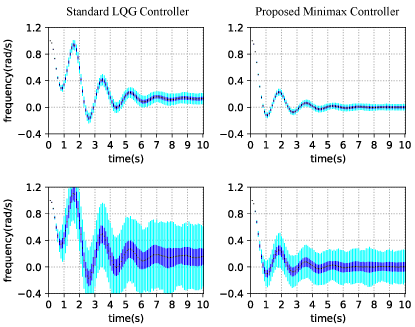

# Minimax Linear Quadratic Control with Wasserstein Distance
Numerical experiments of Minimax Linear Quadratic Controller using the Wasserstein Metric.


### Prerequisites
* Python 3.7, Numpy 1.16.0, Scipy 1.2.1

### Run
The experimental results in the paper can be reproduced by running:
```
python main.py
```

### Modifying Parameters

